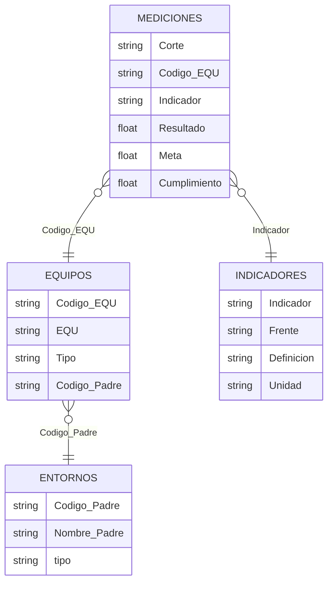

# 1. Experimentación: exploración y calidad

| Notebook | Responde |
|---|---|
| [`notebooks/1_eda.ipynb`](notebooks/1_eda.ipynb) | 1.1 y 1.2: qué es cada fila, cómo separar en tablas y cómo se relacionan las hojas |
| [`notebooks/2_calidad_datos.ipynb`](notebooks/2_calidad_datos.ipynb) | 1.3: registro de problemas de calidad → [`resultados/registro_calidad.csv`](resultados/registro_calidad.csv) |

## 1.1 ¿Qué representa cada fila?

Cada fila de `query` es **el resultado de un indicador, para un equipo, en un mes**. La identifican **`Corte` + `Codigo_EQU` + `Indicador`**: el frente depende del indicador y el nombre depende del código del equipo.

Propuesta de tablas:

## 1.2 ¿La base y los catálogos coinciden?

**No completamente.** Los catálogos describen menos de lo que contiene la base.

| Relación | Lo que se esperaba | Lo que se encontró |
|---|---|---|
| Indicadores de la base → catálogo | Todos documentados | **10 de 25** coinciden exactamente (11 ignorando tildes). Los 14 restantes son **54% de las filas** y no tienen definición ni unidad |
| Catálogo → indicadores de la base | Todos medidos | **2 indicadores sin ningún equipo**: "Adopción de la metodologia" y "Productividad", con la misma definición (índice consolidado de agilidad) |
| Frentes base ↔ catálogo | Mismos nombres | El frente de agilidad tiene **3 nombres** en el tiempo; el error "Modeos…" está también en el catálogo |
| Equipos de la base → catálogo | Todos con entorno | El código se escribe de **146 formas para 89 equipos**. 63 cruzan; **26 son equipos fantasma** (18 históricos, 8 activos en 2026 que faltan en el catálogo) |
| Catálogo → equipos de la base | Todos con mediciones | 1 equipo del catálogo (EQU00023) sin mediciones |
| Equipos → entorno | Un entorno por equipo | 50 equipos en 16 entornos; **12 cuelgan de una vicepresidencia** y 2 están marcados "sin entorno" |

## 1.3 Registro de problemas de calidad

| Id | Problema | Evidencia | Tratamiento |
|---|---|---|---|
| P01 | Filas sin código de equipo | 36 filas (0,2%) | excluir |
| P02 | Nombre de equipo vacío | 6.185 filas (40,7%) | corregir desde el catálogo |
| P03 | Cumplimiento vacío | 265 filas; 59 recalculables | corregir / excluir |
| P04 | Filas repetidas exactamente | 2.182 filas (14,4%), 56% en 202502 | excluir (se deja una) |
| P05 | Mismo equipo, indicador y mes con valores distintos | 1.265 filas; 962 son respuestas de encuesta | corregir (promedio) |
| P06 | Código de equipo mal escrito | 325 filas | corregir |
| P07 | Equipos fantasma | 1.473 filas, 26 equipos | marcar "Sin entorno" |
| P08 | Padre es vicepresidencia o "sin entorno" | 2.218 filas, 13 equipos | marcar "Sin entorno" (se conserva la VP) |
| P09 | Indicadores sin definición | 14 de 25 indicadores, 54% de filas | marcar y documentar |
| P10 | Indicadores del catálogo sin equipos | 2 indicadores | aceptar y reportar |
| P11 | Un frente con 3 nombres | 3.089 filas (20%) | corregir (homologar) |
| P12 | Cumplimiento en escalas distintas (encuestas = puntaje) | 5.498 filas (36%) | corregir (Resultado / Meta) |
| P13 | Cumplimientos imposibles (155 y −1873) | 22 filas | marcar y excluir del análisis |
| P14 | Cumplimiento 1.014683 copiado | 530 filas | marcar y excluir del análisis |
| P15 | Mes con pocos equipos (202510) | 20 equipos vs 64 normal | marcar |

El detalle (impacto incluido) está en [`resultados/registro_calidad.csv`](resultados/registro_calidad.csv).
