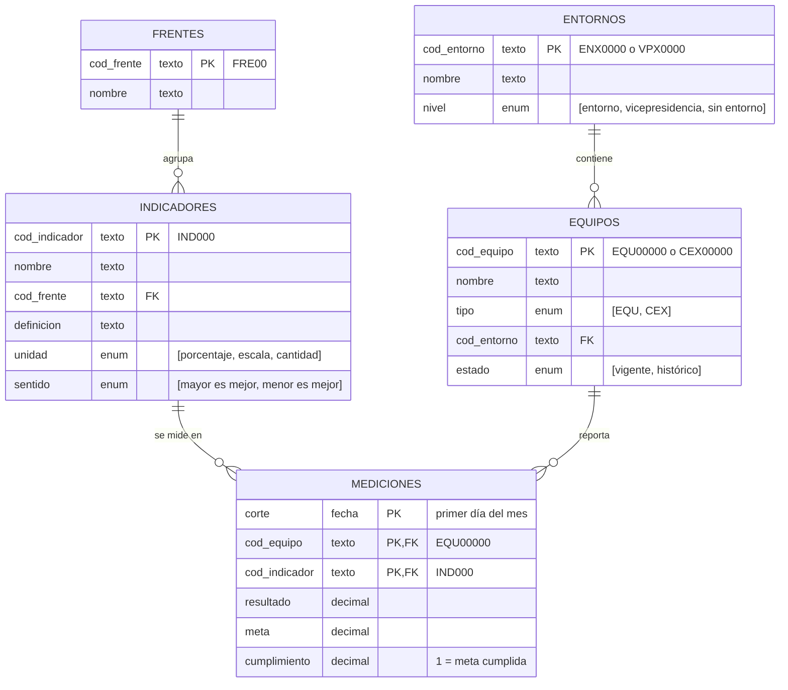

# 1. Experimentación

Exploración y calidad del archivo original (actividad 1). Cada notebook responde un numeral; las gráficas y el paso a paso están dentro de él, con el código contraído para leer solo resultados.

## Ejecución

Desde la raíz del repositorio (Python 3.12+ y [uv](https://docs.astral.sh/uv/)):

```bash
uv sync
uv run jupyter lab
```

Abrir `1_experimentacion/notebooks/` y ejecutar cada notebook de arriba a abajo, en orden. Los notebooks solo leen `0_datos/KPIS_historico.xlsx`; no escriben archivos.

| # | Notebook | Contenido |
|---|---|---|
| 1.1 | [`1_1_exploracion_datos.ipynb`](notebooks/1_1_exploracion_datos.ipynb) | Qué representa cada fila, qué columnas la identifican y si el dataset y los catálogos coinciden (la estructura propuesta está en este README) |
| 1.2 | [`1_2_validacion_catalogos.ipynb`](notebooks/1_2_validacion_catalogos.ipynb) | Contraste con el catálogo de indicadores y el de entornos; diferencias documentadas |
| 1.3 | [`1_3_evaluacion_calidad.ipynb`](notebooks/1_3_evaluacion_calidad.ipynb) | Registro de problemas de calidad: problema, evidencia, impacto y tratamiento |

## Conclusiones

### 1.1 Estructura de datos propuesta

Cada fila del Excel es **el resultado de un indicador, para un equipo, en un mes**, y la identifican `Corte` + `Codigo_EQU` + `Indicador`. Hoy todo vive en una sola hoja que repite en cada fila el nombre del equipo y el frente, y usa nombres como llave. Se propone separarla en una tabla de mediciones y cuatro catálogos:



| Notación | Significado |
|---|---|
| `PK` | Llave primaria: identifica cada fila y no se repite. En Mediciones son tres columnas juntas: un mes, un equipo y un indicador |
| `FK` | Llave foránea: apunta a la llave primaria de otra tabla y solo acepta valores que existan allí |
| `enum "[a, b]"` | Lista cerrada: la columna solo admite los valores entre corchetes |
| `texto` · `fecha` · `decimal` | Tipo de dato de la columna; el texto entre comillas es el formato o una aclaración |
| Línea `\|\|──o{` | Relación uno a muchos: el extremo con doble raya es el "uno" y el de tres patas el "muchos". Un frente agrupa muchos indicadores; cada indicador pertenece a un solo frente |

**Qué representa cada entidad**

| Entidad | Qué guarda | Una fila por | Llave |
|---|---|---|---|
| Mediciones | El resultado mensual de un indicador para un equipo: lo único que cambia cada mes | mes × equipo × indicador | `corte` + `cod_equipo` + `cod_indicador` |
| Equipos | Los equipos (EQU) y células (CEX), vigentes e históricos, y el entorno al que pertenecen | equipo | `cod_equipo` |
| Entornos | La unidad que agrupa equipos: un entorno, una vicepresidencia o "sin entorno" | entorno | `cod_entorno` |
| Indicadores | Qué se mide, en qué unidad y si más alto es mejor | indicador | `cod_indicador` |
| Frentes | La agrupación estratégica de los indicadores | frente | `cod_frente` |

**Por qué es una buena estructura**

Cada dato se guarda **una sola vez, en su tabla, con un código que no cambia**, y las mediciones solo apuntan a esos códigos. Así un cambio de nombre se corrige en un solo lugar, un mismo equipo no puede aparecer como dos, y una medición solo entra si su equipo y su indicador existen en los catálogos. Cada decisión responde a un problema encontrado en 1.2 y 1.3:

| Hallazgo | Decisión de diseño | Evidencia |
|---|---|---|
| 146 escrituras para 89 equipos y nombre vacío en 41% de las filas | Mediciones guarda solo el `cod_equipo` normalizado; el nombre vive una vez en Equipos | 1.2.d · 1.3.a |
| El mismo indicador se escribe distinto entre hojas | Cada indicador tiene un `cod_indicador` propio (hoy no existe: se crea al homologar); el nombre es solo una etiqueta | 1.2.a |
| El frente de agilidad tuvo tres nombres | Mediciones no repite el frente: lo hereda de su indicador, y cada frente existe una vez en Frentes | 1.2.c |
| Encuestas en otra escala; no se sabe si más alto es mejor | Indicadores declara unidad y sentido, para calcular el cumplimiento igual en todos | 1.3.e |
| La columna "padre" mezcla entornos, vicepresidencias y "sin entorno" | Entornos tiene un `nivel` explícito | 1.2.f |
| 26 equipos fantasma, 18 de ellos históricos | Equipos tiene un `estado`: la historia se conserva sin confundirse con lo vigente | 1.2.e |
| Mediciones repetidas o en conflicto | Corte + equipo + indicador es la llave: una sola medición por mes | 1.3.b |

Con esta estructura los problemas de catálogo se detienen en la carga en vez de descubrirse en el análisis. Es el punto de partida de la transformación (actividad 2).

### 1.2 Coincidencia del dataset con los catálogos

| Validación | Resultado |
|---|---|
| Indicadores del dataset registrados en el catálogo | **Solo 10 de 25 (40%)**. Los otros 15 (14 que no aparecen y 1 escrito distinto) representan el **57% de las filas** |
| Indicadores del catálogo con mediciones | **11 de 13**: 2 nunca se miden y tienen la misma definición (un índice consolidado de agilidad) |
| Nombres de frente | El frente de agilidad tiene **3 nombres** en el tiempo; el error "Modeos…" viene del propio catálogo |
| Escritura de los códigos de equipo | **146 formas de escribir 89 equipos** (minúsculas, dígitos de menos) |
| Equipos del dataset registrados en el catálogo | **63 de 89 (71%)**. 26 son equipos fantasma: 18 históricos y **8 activos en 2026** que faltan en el catálogo |
| Equipos con entorno asignado | **Solo 56% (50 de 89)**. 11 cuelgan de una vicepresidencia y 2 están marcados "sin entorno" |

### 1.3 Registro de problemas de calidad

| Tipo | Problema | Evidencia | Tratamiento |
|---|---|---|---|
|  | Filas sin código de equipo | 36 filas (0,2%) | excluir |
|  | Nombre de equipo vacío | 6.185 filas (40,7%) | corregir desde el catálogo |
|  | Cumplimiento vacío | 265 filas; 59 recalculables | corregir / excluir |
|  | Meses con pocos equipos | 202510: 20 equipos vs 64 normal | marcar |
|  | Filas repetidas exactamente | 2.182 filas (14,4%) | excluir (se deja una) |
|  | Filas iguales salvo el nombre del equipo | 13 filas: la misma medición, una con EQU vacío | excluir (se deja la que tiene nombre) |
|  | Mismo equipo, indicador y mes con valores distintos | 1.265 filas; 962 son respuestas de encuesta | corregir (promedio) |
|  | Código de equipo mal escrito | 325 filas (2,1%) | corregir |
|  | Un frente con tres nombres | 3.089 filas (20,3%) | corregir (homologar) |
|  | Equipos fantasma | 1.473 filas (9,7%), 26 equipos | marcar "Sin entorno" |
|  | Equipos con vicepresidencia o sin entorno | 2.218 filas (14,6%), 13 equipos | marcar "Sin entorno" (se conserva la VP) |
|  | Indicadores sin definición | 14 de 25; 8.267 filas (54,4%) | marcar y documentar |
|  | Indicadores del catálogo que nadie mide | 2 de 13 | aceptar y reportar |
|  | Cumplimiento en escalas distintas | 5.498 filas (36,2%): mediana 4,6 en encuestas vs 1,0 en el resto | corregir (Resultado / Meta) |
|  | Cumplimientos imposibles (155 y −1873) | 22 filas | marcar y excluir del análisis |
|  | Cumplimiento copiado (1.014683) | 530 filas (3,5%), casi todas en Disponibilidad e Incidentes | marcar y excluir del análisis |

Impacto y detalle: [`notebooks/1_3_evaluacion_calidad.ipynb`](notebooks/1_3_evaluacion_calidad.ipynb).
