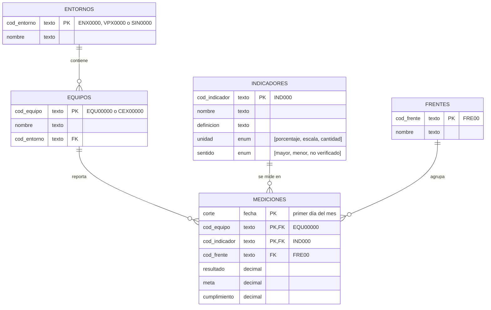

# 1. Experimentación

Exploración y calidad del archivo original (actividad 1). Cada notebook responde un numeral; las gráficas y el paso a paso están dentro de él, con el código contraído para leer solo resultados.

## Ejecución

Desde la raíz del repositorio (Python 3.12+ y [uv](https://docs.astral.sh/uv/)):

```bash
uv sync
uv run jupyter lab
```

Abrir `1_experimentacion/notebooks/` y ejecutar cada notebook de arriba a abajo, en orden. Los notebooks solo leen `0_datos/1_crudos/KPIS_historico.xlsx`; no escriben archivos.

| # | Notebook | Contenido |
|---|---|---|
| 1.1 | [`1_1_exploracion_datos.ipynb`](notebooks/1_1_exploracion_datos.ipynb) | Qué representa cada fila, qué columnas la identifican y si el dataset y los catálogos coinciden (la estructura propuesta está en este README) |
| 1.2 | [`1_2_validacion_catalogos.ipynb`](notebooks/1_2_validacion_catalogos.ipynb) | Contraste con el catálogo de indicadores y el de entornos; diferencias documentadas |
| 1.3 | [`1_3_evaluacion_calidad.ipynb`](notebooks/1_3_evaluacion_calidad.ipynb) | Registro de problemas de calidad: problema, evidencia, impacto y tratamiento |

## Conclusiones

### 1.1 Estructura de datos propuesta

Cada fila del Excel es **el resultado de un indicador, para un equipo, en un mes**, y la identifican `Corte` + `Codigo_EQU` + `Indicador`. Hoy todo vive en una sola hoja que repite en cada fila el nombre del equipo y el frente, y usa nombres como llave. Se propone separarla en una tabla de mediciones y cuatro catálogos:



| Notación | Significado |
|---|---|
| `PK` | Llave primaria: identifica cada fila y no se repite. En Mediciones son tres columnas juntas: un mes, un equipo y un indicador |
| `FK` | Llave foránea: apunta a la llave primaria de otra tabla y solo acepta valores que existan allí |
| `enum "[a, b]"` | Lista cerrada: la columna solo admite los valores entre corchetes |
| `texto` · `fecha` · `decimal` | Tipo de dato de la columna; el texto entre comillas es el formato o una aclaración |
| Línea `\|\|──o{` | Relación uno a muchos: el extremo con doble raya es el "uno" y el de tres patas el "muchos". Un equipo reporta muchas mediciones; cada medición es de un solo equipo |

Cada dato vive **una sola vez, con un código estable**, y las mediciones solo apuntan a esos códigos. Los problemas que motivan cada decisión están en [1.2](#12-coincidencia-del-dataset-con-los-catálogos).

| Entidad | Qué representa | Por qué es una entidad propia |
|---|---|---|
| Mediciones | El resultado de un indicador, para un equipo, en un mes, con el frente con el que se reportó | Es lo único que cambia cada mes; guarda solo códigos, así una medición no puede repetirse ni apuntar a algo inexistente |
| Equipos | Equipos (EQU) y células (CEX) y el entorno al que pertenecen | Un mismo equipo aparece escrito de muchas formas; con un solo registro por código el nombre se corrige en un lugar |
| Entornos | La unidad que agrupa equipos: un entorno, una vicepresidencia o "Sin entorno" | Hay equipos sin entorno en el catálogo o fuera de él; un registro explícito "Sin entorno" evita equipos sin grupo |
| Indicadores | Qué se mide, en qué unidad y si más alto es mejor | El mismo indicador se escribe distinto entre hojas y más de la mitad no está en el catálogo; un código propio y su sentido permiten compararlos |
| Frentes | La agrupación estratégica de las mediciones | Hay frentes mal escritos y frentes fuera del catálogo, y un mismo indicador cambió de frente; cada medición guarda el frente con el que se reportó |

### 1.2 Coincidencia del dataset con los catálogos

| Validación | Resultado |
|---|---|
| Indicadores del dataset registrados en el catálogo | **Solo 10 de 25 (40%)**. Los otros 15 (14 que no aparecen y 1 escrito distinto) representan el **57% de las filas** |
| Indicadores del catálogo con mediciones | **11 de 13**: 2 nunca se miden y tienen la misma definición (un índice consolidado de agilidad) |
| Frentes de la base en el catálogo | **"Talento + Agilidad" no está** en el catálogo (17,6% de las filas), y "Modeos…" es un error de digitación que viene del propio catálogo |
| Escritura de los códigos de equipo | **146 formas de escribir 89 equipos** (minúsculas, dígitos de menos) |
| Equipos del dataset registrados en el catálogo | **63 de 89 (71%)**. 26 son equipos fantasma: 18 históricos y **8 activos en 2026** que faltan en el catálogo |
| Equipos con entorno asignado | **Solo 56% (50 de 89)**. 11 cuelgan de una vicepresidencia y 2 están marcados "sin entorno" |

### 1.3 Registro de problemas de calidad

| Tipo | Problema | Evidencia | Tratamiento |
|---|---|---|---|
|  | Filas sin código de equipo | 36 filas (0,2%); todas tienen un nombre que corresponde a un solo código | corregir (tomar el código del nombre) |
|  | Nombre de equipo vacío | 6.185 filas (40,7%) | corregir desde el catálogo |
|  | Cumplimiento vacío | 265 filas (1,7%) | excluir |
|  | Meses con pocos equipos | 202510: 20 equipos vs 64 normal | marcar |
|  | Filas repetidas exactamente | 2.182 filas (14,4%) | excluir (se deja una) |
|  | Mismo equipo, indicador y mes con valores distintos | 1.265 filas; 962 son respuestas de encuesta | corregir (promedio) |
|  | Código de equipo mal escrito | 325 filas (2,1%) | corregir |
|  | Frente mal escrito (Modeos de trabajo y Agilidad) | 417 filas (2,7%); el error también está en el catálogo | corregir |
|  | Equipos fantasma | 1.473 filas (9,7%), 26 equipos | marcar "Sin entorno" |
|  | Frente que no está en el catálogo | 2.672 filas (17,6%): Talento + Agilidad (2023-24) | aceptar y reportar para actualizar el catálogo |
|  | Equipos con vicepresidencia o sin entorno | 2.218 filas (14,6%), 13 equipos | agrupar con su VP; los marcados sin entorno quedan "Sin entorno" |
|  | Indicadores sin definición | 14 de 25; 8.267 filas (54,4%) | agregar al catálogo como pendiente y documentar |
|  | Indicadores del catálogo que nadie mide | 2 de 13 | aceptar y reportar |
|  | Cumplimiento en escalas distintas | 5.498 filas (36,2%): mediana 4,6 en encuestas vs 1,0 en el resto | corregir (Resultado / Meta) |
|  | Cumplimientos imposibles (155 y −1873) | 22 filas | aceptar: el score compara Resultado con Meta |
|  | Cumplimiento copiado (1.014683) | 530 filas (3,5%), casi todas en Disponibilidad e Incidentes | aceptar: el score compara Resultado con Meta |

Impacto y detalle: [`notebooks/1_3_evaluacion_calidad.ipynb`](notebooks/1_3_evaluacion_calidad.ipynb).
