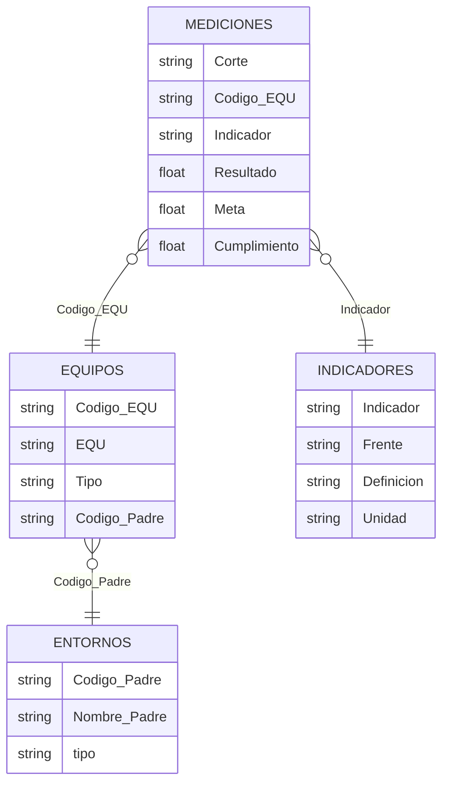
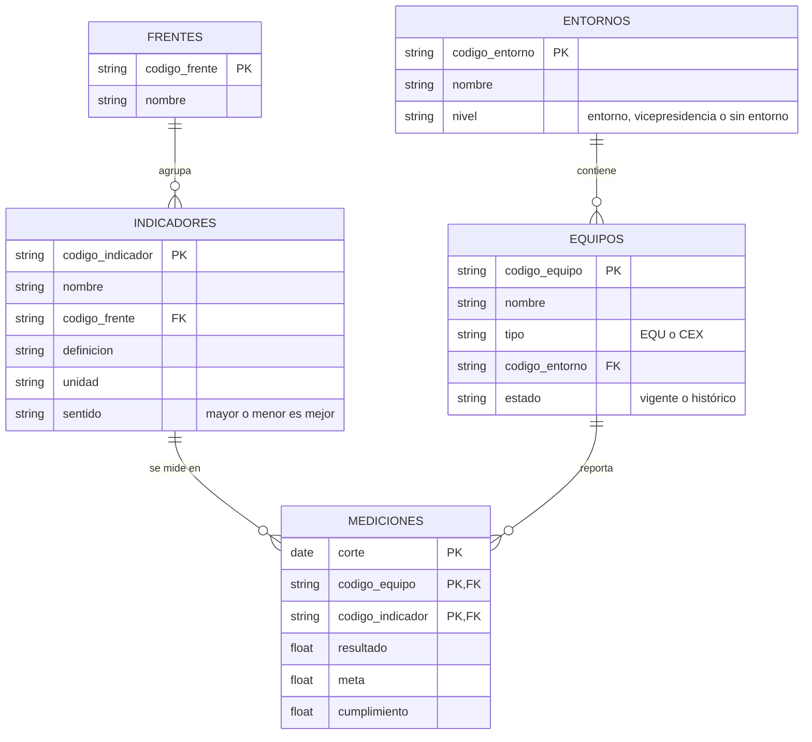

# Base confiable de KPIs por equipo

Prueba técnica – Ingeniero de Datos N2, Estrategia Corporativa. El equipo de estrategia decide dónde enfocar acompañamiento con el histórico `KPIS_historico.xlsx`, pero duda de que los números reflejen la realidad. Aquí se construye una base confiable, se analiza y se propone cómo volverla un proceso recurrente.

## Estructura

```text
0_datos/              # archivo original (nunca se modifica)
1_experimentacion/    # notebooks 1.1 → 1.3: exploración y calidad (actividad 1)
2_transformacion/     # limpieza y dataset analítico (actividades 2 y 3)
3_aplicacion/         # proceso recurrente, decisiones tecnológicas y uso de IA (actividad 4)
```

Cada carpeta tiene su README con el detalle de ejecución.

## Ejecutar

Python 3.12+ y [uv](https://docs.astral.sh/uv/).

```bash
uv sync
uv run jupyter lab
```

Ejecutar los notebooks de cada carpeta en orden, de arriba a abajo.

## 1. Exploración y calidad

### 1.1 ¿Qué es cada fila?

El resultado de **un indicador, para un equipo, en un mes**. La identifican `Corte` + `Codigo_EQU` + `Indicador`: el frente depende del indicador y el nombre depende del código del equipo. Tal como viene en el Excel, la información se puede leer como cuatro tablas:



### 1.2 ¿La base y los catálogos coinciden?

| Pregunta | Respuesta |
|---|---|
| ¿Los indicadores medidos están en el catálogo? | **Solo 10 de 25 indicadores están registrados en el catálogo (40%)**. Los otros 15 (14 que no aparecen y 1 escrito distinto) representan el **57% de las filas** |
| ¿Los indicadores registrados en el catálogo se miden? | **No: 2 de 13 nunca se miden** y tienen la misma definición (un índice consolidado de agilidad) |
| ¿Los frentes tienen un solo nombre? | **No**: el frente de agilidad tiene 3 nombres en el tiempo, y el error "Modeos…" viene del propio catálogo |
| ¿Los códigos de equipo son confiables? | **146 formas de escribir 89 equipos** (minúsculas, dígitos de menos) |
| ¿Los equipos medidos existen en el catálogo? | **63 de 89 (71%)**. 26 son equipos fantasma: 18 históricos y **8 activos en 2026** que faltan en el catálogo |
| ¿Cada equipo tiene un entorno? | **Solo 56% (50 de 89)**. 11 cuelgan de una vicepresidencia y 2 están marcados "sin entorno" |

### 1.3 Problemas de calidad

| Tipo | Problema | Evidencia | Tratamiento |
|---|---|---|---|
|  | Filas sin código de equipo | 36 filas (0,2%) | excluir |
|  | Nombre de equipo vacío | 6.185 filas (40,7%) | corregir desde el catálogo |
|  | Cumplimiento vacío | 265 filas; 59 recalculables | corregir / excluir |
|  | Meses con pocos equipos | 202510: 20 equipos vs 64 normal | marcar |
|  | Filas repetidas exactamente | 2.182 filas (14,4%) | excluir (se deja una) |
|  | Filas iguales salvo el nombre del equipo | 13 filas: la misma medición, una con EQU vacío | excluir (se deja la que tiene nombre) |
|  | Mismo equipo, indicador y mes con valores distintos | 1.265 filas; 962 son respuestas de encuesta | corregir (promedio) |
|  | Código de equipo mal escrito | 325 filas (2,1%) | corregir |
|  | Un frente con tres nombres | 3.089 filas (20,3%) | corregir (homologar) |
|  | Equipos fantasma | 1.473 filas (9,7%), 26 equipos | marcar "Sin entorno" |
|  | Equipos con vicepresidencia o sin entorno | 2.218 filas (14,6%), 13 equipos | marcar "Sin entorno" (se conserva la VP) |
|  | Indicadores sin definición | 14 de 25; 8.267 filas (54,4%) | marcar y documentar |
|  | Indicadores del catálogo que nadie mide | 2 de 13 | aceptar y reportar |
|  | Cumplimiento en escalas distintas | 5.498 filas (36,2%): mediana 4,6 en encuestas vs 1,0 en el resto | corregir (Resultado / Meta) |
|  | Cumplimientos imposibles (155 y −1873) | 22 filas | marcar y excluir del análisis |
|  | Cumplimiento copiado (1.014683) | 530 filas (3,5%), casi todas en Disponibilidad e Incidentes | marcar y excluir del análisis |

Impacto y detalle: [`1_experimentacion/notebooks/1_3_evaluacion_calidad.ipynb`](1_experimentacion/notebooks/1_3_evaluacion_calidad.ipynb).

### Modelo de datos propuesto

El Excel ya sugiere cuatro tablas (1.1), pero el análisis muestra por qué hoy no son confiables: nombres que cambian, códigos escritos de varias formas y catálogos incompletos. La propuesta parte de una regla simple: **cada dato se guarda una sola vez, en su tabla, identificado por un código que no cambia**. Las mediciones solo apuntan a esos códigos.



| Lo que encontramos | Decisión de diseño | Dónde verlo |
|---|---|---|
| 146 escrituras para 89 equipos y nombre vacío en 41% de las filas | Mediciones guarda solo el `codigo_equipo` normalizado; el nombre vive una vez en Equipos | 1.2.d · 1.3.a |
| El mismo indicador se escribe distinto entre hojas | Cada indicador tiene un `codigo_indicador` propio (hoy no existe: se crea al homologar); el nombre es solo una etiqueta | 1.2.a |
| El frente de agilidad tuvo tres nombres | Mediciones no repite el frente: lo hereda de su indicador, y cada frente existe una vez en Frentes | 1.2.c |
| Encuestas en otra escala; no se sabe si más alto es mejor | Indicadores declara unidad y sentido, para calcular el cumplimiento igual en todos | 1.3.e |
| La columna "padre" mezcla entornos, vicepresidencias y "sin entorno" | Entornos tiene un `nivel` explícito | 1.2.f |
| 26 equipos fantasma, 18 de ellos históricos | Equipos tiene un `estado`: la historia se conserva sin confundirse con lo vigente | 1.2.e |
| Mediciones repetidas o en conflicto | Corte + equipo + indicador es la llave: una sola medición por mes | 1.3.b |

Con este modelo, una medición solo entra si su equipo y su indicador existen en los catálogos. Los problemas de catálogo dejan de descubrirse durante el análisis y pasan a detenerse en la carga, que es el punto de partida de la transformación (actividad 2) y del proceso recurrente (actividad 4). Cada decisión enlaza a la sección del notebook donde está la evidencia.
