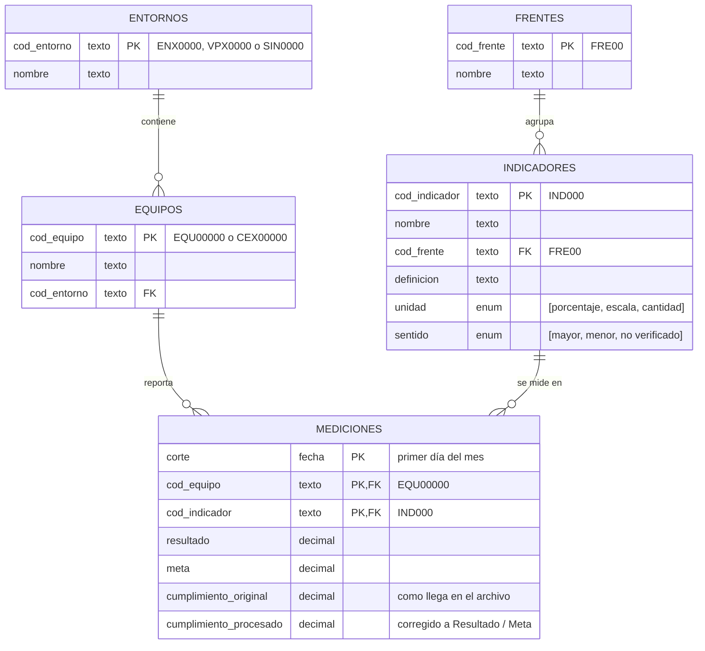

# Entrevista Técnica DE Game

Prueba técnica – Ingeniero de Datos N2, Estrategia Corporativa. Se presenta la construcción de una base confiable, junto con su análisis y propuesta de automatización.

## Contenido

1. [Estructura y requisitos](#1-estructura-y-requisitos)
2. [Exploración y calidad (actividad 1)](#2-exploración-y-calidad-actividad-1)
3. [Transformación (actividad 2)](#3-transformación-actividad-2)
4. [Hallazgos (actividad 3)](#4-hallazgos-actividad-3)
5. [Solución técnica y decisiones tecnológicas (actividad 4)](#5-solución-técnica-y-decisiones-tecnológicas-actividad-4)
6. [Uso de inteligencia artificial](#6-uso-de-inteligencia-artificial)

## 1. Estructura y requisitos

```text
0_datos/1_crudos/       # KPIS_historico.xlsx tal como se entregó (nunca se modifica)
0_datos/2_procesados/   # datos normalizados (_procesado.xlsx) y calidad del proceso (_calidad.xlsx)
0_datos/3_score/        # score por equipo, frente y entorno (_score.xlsx)
1_experimentacion/      # notebooks de exploración y calidad
2_transformacion/src/   # proceso recurrente: main.py, etl/ y score/
3_reporte/              # reporte HTML de hallazgos (actividad 3)
4_aplicacion/           # bitácora de uso de IA
.github/                # reglas, skills y prompts para la IA
```

Requisitos: Python 3.12+ y [uv](https://docs.astral.sh/uv/). Desde la raíz, `uv sync` instala las dependencias.

## 2. Exploración y calidad (actividad 1)

```bash
uv run jupyter lab
```

En `1_experimentacion/notebooks/` se ejecutan en orden `1_1_exploracion_datos`, `1_2_validacion_catalogos` y `1_3_evaluacion_calidad`. Solo leen el archivo crudo; el código está contraído para leer los resultados.

### 1.1 Qué representa cada fila y estructura propuesta

Cada fila es **el resultado de un indicador, para un equipo, en un mes**, identificada por `Corte` + `Codigo_EQU` + `Indicador`. Hoy todo vive en una hoja que repite nombres y frentes en cada fila y usa nombres como llave.

**Supuesto de diseño:** el archivo sugiere cuatro tablas (mediciones, equipos, entornos e indicadores). Se corrige a cinco: cada dato vive una sola vez con un código estable, y las mediciones solo guardan códigos. Un frente agrupa muchos indicadores. Si un mismo nombre se reportó en dos frentes (Percepción, Adopción y Talento + Agilidad), son indicadores distintos, porque no se puede asumir que midan lo mismo.



`PK` identifica cada fila; `FK` apunta a la llave de otra tabla y solo acepta valores que existan allí; `enum` es una lista cerrada.

### 1.2 Coincidencia entre la base y los catálogos

| Validación | Resultado |
|---|---|
| Indicadores de la base en el catálogo | **10 de 25**; los otros 15 son el **57% de las filas** |
| Indicadores del catálogo con mediciones | 11 de 13 |
| Frentes de la base en el catálogo | "Talento + Agilidad" no está (17,6% de las filas); "Modeos…" es un error que viene del catálogo |
| Escritura de los códigos de equipo | **146 formas de escribir 89 equipos** |
| Equipos de la base en el catálogo | 63 de 89; **26 fantasma**, 8 de ellos activos en 2026 |
| Equipos con entorno | **50 de 89**; 11 cuelgan de una vicepresidencia |

### 1.3 Problemas de calidad

| Tipo | Problema | Evidencia | Tratamiento |
|---|---|---|---|
|  | Código de equipo vacío | 36 filas; todas tienen un nombre que identifica un solo código | corregir |
|  | Nombre de equipo vacío | 6.185 filas (40,7%) | corregir desde el código |
|  | Resultado, Meta o Cumplimiento vacíos | 481 filas sin Resultado o Meta; 265 sin Cumplimiento (se solapan) | excluir |
|  | Meses con pocos equipos | 202510: 20 equipos vs 64 normal | marcar |
|  | Filas repetidas | 2.182 filas (14,4%) | excluir (se deja una) |
|  | Mismo mes, equipo e indicador con valores distintos | 1.265 filas; 962 son respuestas de encuesta | corregir (promedio) |
|  | Código de equipo mal escrito | 325 filas | corregir |
|  | Frente mal escrito ("Modeos…") | 417 filas | corregir |
|  | Equipos fantasma | 1.473 filas, 26 equipos | agregar con entorno "Sin entorno" |
|  | Frente fuera del catálogo | 2.672 filas (Talento + Agilidad) | aceptar y reportar |
|  | Equipos con vicepresidencia o sin entorno | 2.218 filas, 13 equipos | agrupar con su VP o en "Sin entorno" |
|  | Indicadores sin definición | 14 de 25; 54% de las filas | agregar como pendientes |
|  | Indicadores del catálogo que nadie mide | 2 de 13 | aceptar y reportar |
|  | Cumplimiento de encuestas en la escala del puntaje | 9,43 sobre una meta de 10 | corregir (Resultado / Meta) |
|  | Cumplimiento copiado en varios equipos (155,42; 1.014683; 1,2) | 334 mediciones | corregir (Resultado / Meta) |
|  | Cumplimiento negativo en Gestión del Gasto (−1873) | 3 filas | aceptar: el score compara Resultado con Meta |

## 3. Transformación (actividad 2)

```bash
uv run python 2_transformacion/src/main.py
```

Por cada Excel de `0_datos/1_crudos/` publica:
- **`_procesado.xlsx`**: el dataset analítico, que es el modelo normalizado (`frentes`, `indicadores`, `entornos`, `equipos`, `mediciones`).
- **`_calidad.xlsx`**: `registro_calidad`, `trazabilidad` (cada fila excluida, corregida, completada o agrupada, con su fila en el Excel original y qué cambió) y `validaciones`.
- **`_score.xlsx`**: el score por equipo, frente, entorno y mes.

Si el archivo no trae las hojas o columnas esperadas, o falla una validación, no publica nada y termina con código 1. Cada ejecución parte del archivo crudo y da el mismo resultado.

**Pasos de limpieza** (una función por regla en `etl/limpieza.py`, en este orden):
1. **Código de equipo:** a mayúsculas y 5 dígitos; si está vacío, se toma del nombre del equipo, porque cada nombre corresponde a un solo código.
2. **Frente:** se corrige "Modeos…". **"Talento + Agilidad" se conserva:** no está en el catálogo y sus indicadores no coinciden con los de ningún frente, así que no se asume que sea otro con otro nombre.
3. **Vacíos:** se excluyen las filas sin Resultado, Meta o Cumplimiento. Imputarlas inventaría una medición que el equipo no reportó.
4. **Repetidos:** se excluyen las filas repetidas y se deja una.
5. **Promedio por indicador:** varias filas del mismo mes, equipo e indicador (sobre todo respuestas individuales de encuesta) se promedian en una sola medición.
6. **Cumplimiento procesado:** se conserva el original y se agrega `cumplimiento_procesado`, que vale Resultado / Meta (con meta positiva) en dos casos. Con meta 0 o negativa no hay contra qué calcular.
   - **Escala:** el original es igual al Resultado; corrige la escala de las encuestas.
   - **Valor copiado:** el mismo valor aparece en 5 o más equipos del mismo indicador y mes con resultados distintos, como el 155,42 de Incidentes 202408. Se exceptúa el valor que es un tope y que el resultado supera.

**Normalización al modelo propuesto** (`etl/modelo.py`): se separan las cinco tablas con códigos estables (`IND000`, `FRE00`, `SIN0000` para "Sin entorno"). Cada indicador apunta a su frente y se completan los catálogos.
- **Indicadores:** se conservan los que nadie mide y se agregan los medidos sin catálogo, con definición y unidad "Pendiente".
- **Equipos:** se agregan los que no están en el catálogo, con entorno "Sin entorno".
- **Frentes:** se incluye "Talento + Agilidad".

De 15.188 filas quedan **11.466 mediciones** (mes × equipo × indicador).

**Métrica comparable (2.2): meta cumplida.**
- **Definición:** vale 1 si el resultado alcanza la meta según el sentido del indicador (≥ si más es mejor, ≤ si menos es mejor) y 0 si no. El score de un equipo en un mes es la proporción de sus indicadores que cumplieron, todos con el mismo peso.
- **Por qué es comparable:** no depende de la unidad ni de la escala, y ningún extremo domina.
- **Sentido no verificado:** en 3 indicadores no se pudo deducir el sentido; se usa `cumplimiento_procesado ≥ 1` y se debe confirmar con su dueño.

**Agregación por entorno (2.3): mediana de los equipos.**
- **Por qué la mediana:** cada equipo cuenta una vez y un extremo no mueve el resultado; siempre se acompaña de `n_equipos` y el rango.
- **Vicepresidencias:** los equipos que cuelgan de una vicepresidencia se agrupan con ella.
- **Sin entorno:** esos equipos se cuentan pero no se califican como grupo, porque mezclarían áreas sin relación.

**Limitaciones:**
- Se pierde magnitud: quedar al 99% o al 50% de la meta cuenta igual.
- Las encuestas tienen como meta el puntaje máximo, así que casi nunca se cumplen.
- La mezcla de indicadores cambia cada año, así que el score compara bien entre equipos de un mismo mes.

## 4. Hallazgos (actividad 3)

```bash
uv run python 3_reporte/generar_reporte.py
```

Genera `3_reporte/reporte.html`, un reporte interactivo calculado desde el archivo de score; las cifras de abajo salen de él.

| # | Hallazgo | Evidencia | Interpretación | Certeza |
|---|---|---|---|---|
| 1 · Equipos | Lo que se mide pesa 10 veces más que quién lo mide | Qué indicador y en qué mes explica el **48%** de las diferencias en metas cumplidas; qué equipo, el 5% | Un equipo puede verse mal solo por tener metas difíciles: calibrar metas antes de comparar | Alta |
| 2 · Entornos | La comparación justa cambia a quién acompañar | Entorno 8 cumple el 33% de sus metas (puesto 20), pero supera a sus pares en 9,5 puntos (puesto 5); Entorno 13 parece bien y está 6,6 puntos bajo sus pares | Priorizar el acompañamiento comparando con quienes miden lo mismo | Media: entornos de 1 a 4 equipos |
| 3 · Tendencia | En 2026 no bajó el desempeño: subió la meta | Disponibilidad: el resultado sigue cerca de 99,7%, la meta pasa de 99,2% a 99,6% y los equipos que cumplen bajan de 98% a 57% | Registrar los cambios de meta junto a la tendencia | Alta en datos |

*Comparación justa: cada resultado frente al de los equipos que miden el mismo indicador en el mismo mes.*

**Qué no se puede concluir:** por qué cambian las metas, el efecto del acompañamiento, el entorno de los equipos fuera del catálogo y la magnitud del cumplimiento.

**Información que haría falta:** el histórico de metas y cómo se fijan, el catálogo de entornos con fechas, la definición de los indicadores pendientes y el registro de acompañamientos.

## 5. Solución técnica y decisiones tecnológicas (actividad 4)

Pendiente.

## 6. Uso de inteligencia artificial

La IA (Claude Code y GitHub Copilot) es fundamental para agilizar el trabajo: explora, escribe código y prueba hipótesis contra los datos en minutos. Para que esa velocidad no sacrifique calidad, el proyecto define en `.github/` las reglas, skills y prompts que la IA debe seguir:
- **Reglas** (`instructions/`): código limpio, estándar de notebooks y de datos.
- **Skills** (`skills/`): cómo agregar una regla de limpieza, probar una hipótesis contra los datos, registrar la bitácora y graficar con la paleta.
- **Prompts** (`prompts/`): las tareas que se repiten.

Así cualquier persona del equipo obtiene el mismo estándar y las buenas prácticas quedan escritas, no en la memoria de alguien.

Las decisiones de criterio fueron humanas y cada propuesta de la IA se validó contra los datos. La [bitácora](4_aplicacion/bitacora_ia.md) registra los prompts, lo aceptado, lo corregido y lo descartado. Tres ejemplos:
- **Frente "Talento + Agilidad":** la IA lo había homologado a "Modelos de trabajo y Agilidad". El humano lo corrigió porque sus indicadores no coinciden con el catálogo.
- **Recálculo de Cumplimiento:** la IA propuso recalcular todo como Resultado / Meta. Una prueba por indicador mostró que eso inventaba valores (Regulatorio topa en 1, Índice AQR's está en otra unidad), así que solo se recalculan dos casos con evidencia: la escala de las encuestas y los valores copiados.
- **Filas sin código:** se iban a excluir. Al validarlas, las 36 resultaron recuperables desde el nombre del equipo.
