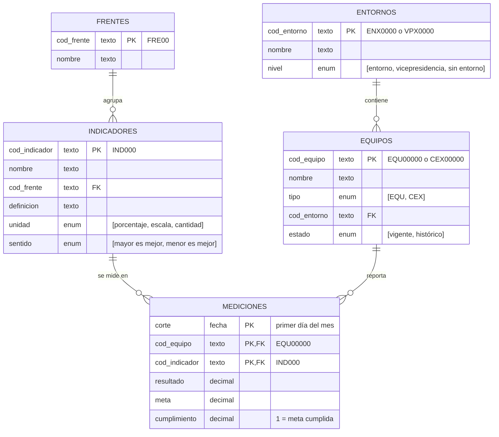

# Entrevista Técnica DE Game

Prueba técnica – Ingeniero de Datos N2, Estrategia Corporativa. Se presenta la construcción de una base confiable, junto con su análisis y propuesta de automatización.

## Estructura

```text
0_datos/              # archivo original (nunca se modifica)
1_experimentacion/    # exploración y calidad de datos (actividad 1)
2_transformacion/     # limpieza y dataset analítico (actividades 2 y 3)
3_aplicacion/         # proceso recurrente, decisiones tecnológicas y uso de IA (actividad 4)
```

Cada módulo tiene su README con cómo ejecutarlo y el detalle de sus resultados.

## Conclusiones por módulo

### 1. Experimentación

En esta sección se entienden los datos, desde su forma hasta el contenido que yace en el archivo. Empíricamente se evidencia una arquitectura de cuatro tablas (mediciones, equipos, entornos e indicadores), pero con problemas estructurales grandes como:
- Más de la mitad de las filas usan indicadores que el catálogo no conoce
- Un mismo equipo aparece escrito de varias formas
- Más de un tercio de las filas reporta el cumplimiento en otra escala

Como conclusión, se registran 16 problemas de calidad con su tratamiento, sin embargo, para evitar que se repitan se propone un modelo donde cada dato vive una sola vez, identificado por un código estable, y las mediciones solo apuntan a esos códigos:



### 2. Transformación

Pendiente.

### 3. Aplicación

Pendiente.
