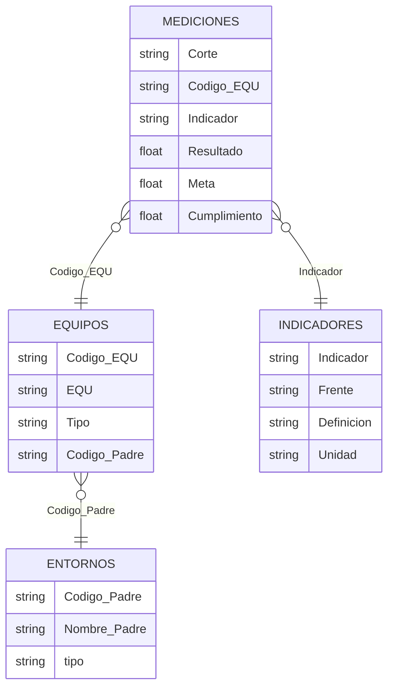

# Base confiable de KPIs por equipo

Prueba técnica – Ingeniero de Datos N2, Estrategia Corporativa. El equipo de estrategia decide dónde enfocar acompañamiento con el histórico `KPIS_historico.xlsx`, pero duda de que los números reflejen la realidad. Aquí se construye una base confiable, se analiza y se propone cómo volverla un proceso recurrente.

## Estructura

```text
0_datos/              # archivo original (nunca se modifica)
1_experimentacion/    # notebooks 1 → 2: exploración y calidad (actividad 1)
2_transformacion/     # limpieza y dataset analítico (actividades 2 y 3)
3_aplicacion/         # proceso recurrente, decisiones tecnológicas y uso de IA (actividad 4)
```

Cada carpeta tiene su README con el detalle de ejecución.

## Ejecutar

Python 3.12+ y [uv](https://docs.astral.sh/uv/).

```bash
uv sync
uv run jupyter lab
```

Ejecutar los notebooks de cada carpeta en orden, de arriba a abajo.

## 1. Exploración y calidad

### 1.1 ¿Qué es cada fila?

El resultado de **un indicador, para un equipo, en un mes**. La identifican `Corte` + `Codigo_EQU` + `Indicador`: el frente depende del indicador y el nombre depende del código del equipo. Según lo anterior, se infiere un posible esquema de datos:



### 1.2 ¿La base y los catálogos coinciden?

| Pregunta | Respuesta |
|---|---|
| ¿Los indicadores medidos están en el catálogo? | **Solo 10 de 25 (40%)**. 1 está escrito distinto y 14 no aparecen: son el **54% de las filas** |
| ¿Todos los indicadores del catálogo se miden? | **No: 2 de 13 nunca se miden** y tienen la misma definición (un índice consolidado de agilidad) |
| ¿Los frentes tienen un solo nombre? | **No**: el frente de agilidad tiene 3 nombres en el tiempo, y el error "Modeos…" viene del propio catálogo |
| ¿Los códigos de equipo son confiables? | **146 formas de escribir 89 equipos** (minúsculas, dígitos de menos) |
| ¿Los equipos medidos existen en el catálogo? | **63 de 89 (71%)**. 26 son equipos fantasma: 18 históricos y **8 activos en 2026** que faltan en el catálogo |
| ¿Cada equipo tiene un entorno? | **Solo 56% (50 de 89)**. 11 cuelgan de una vicepresidencia y 2 están marcados "sin entorno" |

### 1.3 Problemas de calidad

| Tipo | Problema | Evidencia | Tratamiento |
|---|---|---|---|
|  | Filas sin código de equipo | 36 filas (0,2%) | excluir |
|  | Nombre de equipo vacío | 6.185 filas (40,7%) | corregir desde el catálogo |
|  | Cumplimiento vacío | 265 filas; 59 recalculables | corregir / excluir |
|  | Meses con pocos equipos | 202510: 20 equipos vs 64 normal | marcar |
|  | Filas repetidas exactamente | 2.182 filas (14,4%) | excluir (se deja una) |
|  | Mismo equipo, indicador y mes con valores distintos | 1.265 filas; 962 son respuestas de encuesta | corregir (promedio) |
|  | Código de equipo mal escrito | 325 filas (2,1%) | corregir |
|  | Un frente con tres nombres | 3.089 filas (20,3%) | corregir (homologar) |
|  | Equipos fantasma | 1.473 filas (9,7%), 26 equipos | marcar "Sin entorno" |
|  | Equipos con vicepresidencia o sin entorno | 2.218 filas (14,6%), 13 equipos | marcar "Sin entorno" (se conserva la VP) |
|  | Indicadores sin definición | 14 de 25; 8.267 filas (54,4%) | marcar y documentar |
|  | Indicadores del catálogo que nadie mide | 2 de 13 | aceptar y reportar |
|  | Cumplimiento en escalas distintas | 5.498 filas (36,2%): encuestas ≈ 4.4, resto ≈ 1.0 | corregir (Resultado / Meta) |
|  | Cumplimientos imposibles (155 y −1873) | 22 filas | marcar y excluir del análisis |
|  | Cumplimiento copiado (1.014683) | 530 filas (3,5%) | marcar y excluir del análisis |

Impacto y detalle: [`1_experimentacion/resultados/registro_calidad.csv`](1_experimentacion/resultados/registro_calidad.csv).
