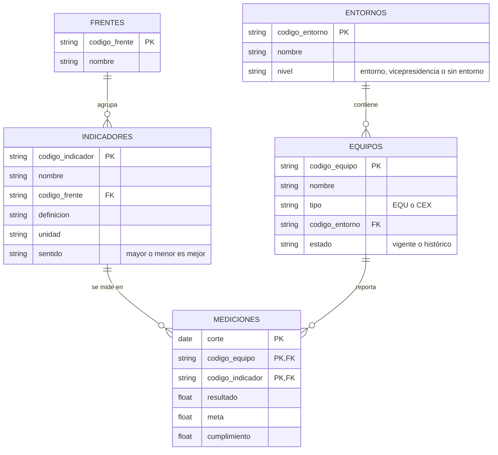

# Base confiable de KPIs por equipo

Prueba técnica – Ingeniero de Datos N2, Estrategia Corporativa. El equipo de estrategia decide dónde enfocar acompañamiento con el histórico `KPIS_historico.xlsx`, pero duda de que los números reflejen la realidad. Aquí se construye una base confiable, se analiza y se propone cómo volverla un proceso recurrente.

## Estructura

```text
0_datos/              # archivo original (nunca se modifica)
1_experimentacion/    # exploración y calidad de datos (actividad 1)
2_transformacion/     # limpieza y dataset analítico (actividades 2 y 3)
3_aplicacion/         # proceso recurrente, decisiones tecnológicas y uso de IA (actividad 4)
```

Cada módulo tiene su README con cómo ejecutarlo y el detalle de sus resultados.

## Conclusiones por módulo

### 1. Experimentación

Los datos dejan ver un modelo de cuatro tablas (mediciones, equipos, entornos e indicadores), pero no se pueden usar tal como vienen: **más de la mitad de las filas usan indicadores que el catálogo no conoce**, **un mismo equipo aparece escrito de varias formas** (146 escrituras para 89 equipos, 26 de ellos fuera del catálogo) y **más de un tercio de las filas reporta el cumplimiento en otra escala**. Se registran 16 problemas de calidad con su tratamiento.

Para evitar que se repitan, se propone un modelo donde cada dato vive una sola vez, identificado por un código estable, y las mediciones solo apuntan a esos códigos:



Así cada indicador, equipo, entorno y frente se segmenta de forma única, y lo que no exista en los catálogos se detiene antes de llegar al análisis. Detalle, evidencia y decisiones en [`1_experimentacion/`](1_experimentacion/README.md).

### 2. Transformación

Pendiente.

### 3. Aplicación

Pendiente.
